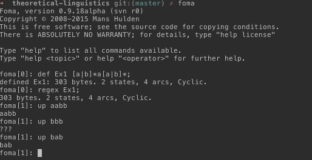

COGS 532 - Week 3 - Spring 2024
--------------------------------

Reading
-------

* Beesley and Karttunen, Chapter 2 (up to 2.4).
* [Getting started with `foma`](https://github.com/mhulden/foma/blob/master/foma/docs/simpleintro.md)

Assignment
----------

[**4pts**] Check out the [notes](../pdfs/01_cogs501-regular-languages.pdf) on regular
languages to review and further digest what we have seen in class so far. We
have not talked about regular expressions yet; but it should be easy to switch
from the notation of regular languages to regular expressions. Your task:

* Try to solve Exercise 4.4 on your own.
* Check the solutions for the items you couldn't work out.
* Here is what will be graded: Write the solutions of the first 4 items in
  `foma` notation and try them out in `foma`. Send us your screenshot. It should
  look like the one below, assuming the regular language you try to implement is
  the language defined on $\\{a,b\\}$ that contains all the strings with at least
  one $a$:

